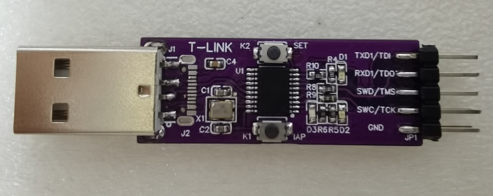

# T-Link

------

此项目使用CH32V305FBP6实现了一个CMSIS-DAP, 并同时提供了两路CDC串口. 串口是免驱动的, 但如果想显示指定的串口名字, 这里也提供一个简单的驱动. 在驱动inf文件上右键选择安装即可.

USB部分使用了CherryUSB库.  
SWD和JTAG接口都是IO模拟的时序。在速度1M以下还算精确, 1M以上就不怎么准确了.

项目使用MounRiver编译. 下载需使用WCH的DAP工具. 

https://oshwhub.com/tpunix/wch_dap

